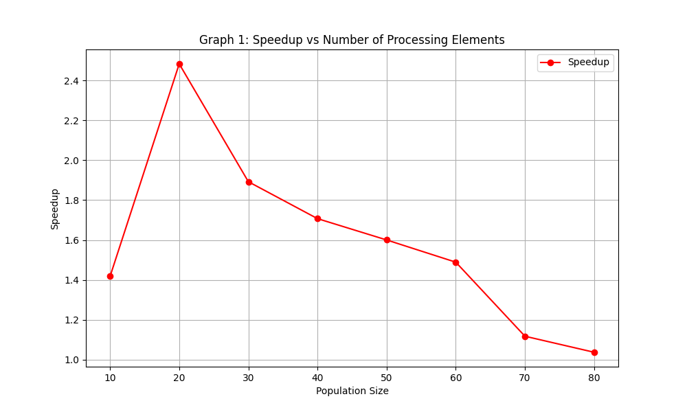
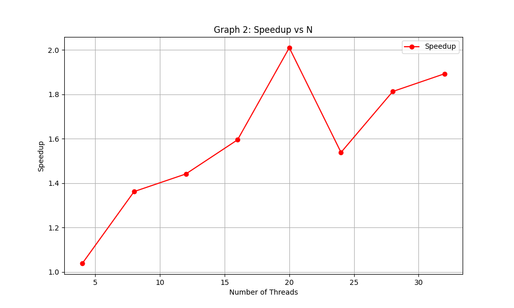
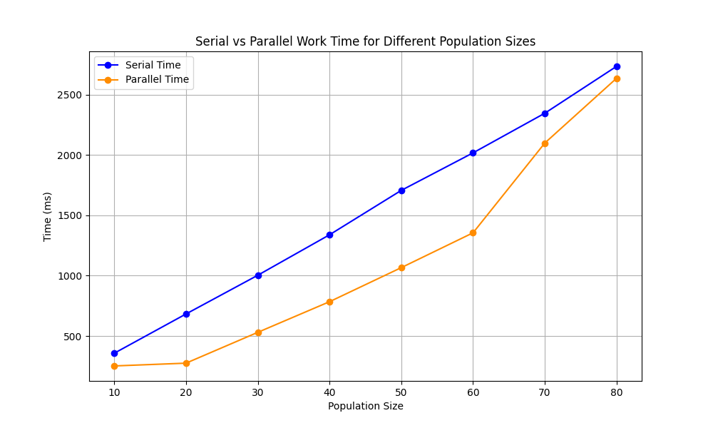

# PARALLEL ANT COLONY OPTIMIZATION FOR TRAVEL SALESMAN PROBLEM

There are two files:

Main.cpp -> serial ACO code for Travelling salesman problem

Mainpar.cpp -> parralel ACO code for Travelling salesman problem

